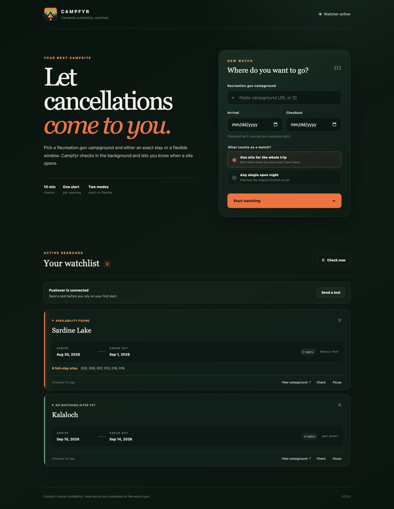
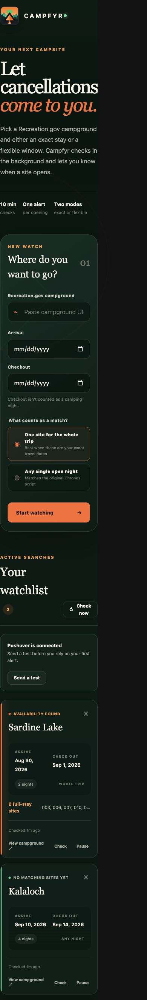
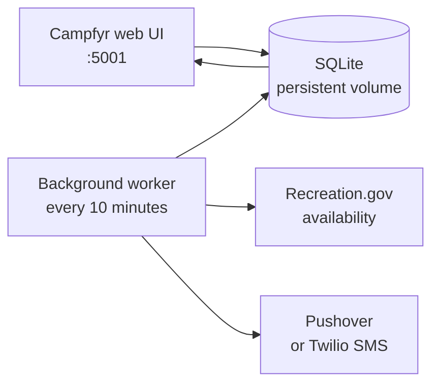

<p align="center">
  
</p>

<h1 align="center">Campfyr</h1>

<p align="center">
  <strong>A self-hosted Recreation.gov campsite monitor that watches the dates you care about and tells you when a site opens.</strong>
</p>

<p align="center">
  
  
  
  
</p>



Campfyr runs quietly on a NAS or home server. Paste a Recreation.gov campground URL, choose your dates, and let the background worker check for cancellations. When a match appears, Campfyr sends the open site numbers and booking link through Pushover—or optionally by Twilio SMS.

## Why Campfyr?

| | |
| --- | --- |
| **Two match modes** | Find one site for your entire trip, or any single open night in a flexible window. |
| **Useful alerts, not spam** | Notifications are de-duplicated and only repeat when new availability appears. |
| **Built for a NAS** | The web app and worker are separate Docker services with restart policies and health checks. |
| **Durable storage** | SQLite replaces the original shared JSON file and lives in a persistent Docker volume. |
| **Visible health** | See worker status, recent checks, errors, matching site numbers, and notification setup in the UI. |
| **Private by default** | Credentials stay in `.env`; optional HTTP Basic authentication protects installs beyond a trusted LAN. |

## Quick start

You need Docker Engine and Docker Compose.

```sh
git clone https://github.com/sidewinder5675/campfyr.git
cd campfyr
cp .env.example .env
```

Open `.env` and add your existing Pushover credentials:

```dotenv
NOTIFICATION_PROVIDER=pushover
PUSHOVER_USER_KEY=your_user_key
PUSHOVER_API_TOKEN=your_application_token
```

Build and start Campfyr:

```sh
docker compose up -d --build
```

Open `http://YOUR-NAS-IP:5001`, add a campground, and click **Send a test** before relying on your first alert.

```sh
# Confirm both services are healthy
docker compose ps

# Follow the availability checker
docker compose logs -f worker
```

## Using Campfyr

1. Open a campground on [Recreation.gov](https://www.recreation.gov/).
2. Paste its URL—or just its numeric campground ID—into Campfyr.
3. Choose arrival and checkout. Checkout is not counted as a camping night.
4. Pick a matching mode:
   - **One site for the whole trip** requires the same campsite every night.
   - **Any single open night** reports isolated openings anywhere in the window.
5. Click **Start watching**. Campfyr checks immediately and then every 10 minutes by default.

When availability appears, the alert includes the campground, dates, open site numbers, and a direct booking link. Campfyr does not reserve or hold the site—you still complete the reservation on Recreation.gov.

## Screenshots

<p align="center">
  
</p>

The responsive interface supports adding watches, checking now, pausing or resuming searches, removing old trips, testing notifications, and opening the campground page directly.

## How it works



The web service manages watches and displays results. A separate worker reads active watches, requests the required monthly availability grids, finds valid matches, records the result, and sends an alert only when availability is new.

Temporary Recreation.gov failures are retried with backoff and shown in the UI instead of silently stopping the monitor.

## Pushover setup

Campfyr uses Pushover's HTTPS Message API. If your old Chronos script stores the keys in `config.json`, move the values into `.env`:

| Old `config.json` key | New `.env` key |
| --- | --- |
| `pushover_user_key` | `PUSHOVER_USER_KEY` |
| `pushover_api_token` | `PUSHOVER_API_TOKEN` |

Keep `.env` private. It is excluded from Git and the Docker build context. The UI works without notification keys, but Campfyr cannot send alerts until both values are configured and the services are restarted.

## Import the original watchlist

The legacy `campSiteRequests.json` format can be imported into SQLite:

```sh
docker compose run --rm web python -m campfyr.migrate /app/campSiteRequests.json
```

Duplicate campground/date combinations are skipped. Past trips are retained as expired watches. Imported watches use **Any single open night** mode, matching the original `camply` script. Because the old range was inclusive, its final date becomes the new checkout date plus one day.

## Configuration

| Variable | Default | Purpose |
| --- | --- | --- |
| `NOTIFICATION_PROVIDER` | `pushover` | `pushover` or `twilio` |
| `PUSHOVER_USER_KEY` | empty | Pushover user or group key |
| `PUSHOVER_API_TOKEN` | empty | Pushover application token |
| `CHECK_INTERVAL_SECONDS` | `600` | Background interval; the minimum is 60 seconds |
| `RECREATION_TIMEOUT_SECONDS` | `20` | Recreation.gov request timeout |
| `CAMPFYR_USERNAME` | empty | Optional HTTP Basic authentication username |
| `CAMPFYR_PASSWORD` | empty | Optional HTTP Basic authentication password |
| `CAMPFYR_DATABASE_PATH` | `/data/campfyr.db` | SQLite database location in Docker |
| `LOG_LEVEL` | `INFO` | Worker log level |

For optional SMS alerts, set `NOTIFICATION_PROVIDER=twilio` and fill in all four `TWILIO_*` values included in `.env.example`.

## Updating and backing up

Update a checkout with:

```sh
git pull
docker compose up -d --build
```

The `campfyr-data` Docker volume contains the SQLite database. Include that volume in the NAS backup routine. The container image and source checkout can always be recreated; the volume is the state worth preserving.

## Chronos or cron mode

The included continuous worker is the recommended setup. If Chronos should own the schedule instead, stop the `worker` service and run:

```sh
python -m campfyr.worker --once
```

Schedule it every 600 seconds in a container that uses the same `.env` and `/data` volume. Do not run the continuous worker and the one-shot job together, or simultaneous checks may produce duplicate notifications.

## Development

Campfyr targets Python 3.12.

```sh
python -m venv .venv
. .venv/bin/activate
pip install -r requirements-dev.txt
python -m pytest -q
```

Run the web app locally:

```sh
flask --app 'campfyr:create_app()' run --port 5001 --debug
```

Run the worker against a local database:

```sh
export CAMPFYR_DATABASE_PATH=instance/campfyr.db
python -m campfyr.worker
```

### Project layout

```text
campfyr/
├── campfyr/              Flask app, storage, API client, alerts, and worker
├── static/               Browser JavaScript, styles, and Campfyr artwork
├── templates/            Web interface
├── tests/                API, matching, and alert tests
├── compose.yaml          NAS-friendly web + worker deployment
├── Dockerfile            Python 3.12 production image
└── .env.example          Safe configuration template
```

## Troubleshooting

| Symptom | What to check |
| --- | --- |
| **Watcher starting** never changes | Run `docker compose ps` and `docker compose logs worker`. |
| Notifications need setup | Confirm both Pushover values are in `.env`, restart, then use **Send a test**. |
| A watch shows an error | Check the worker log. Recreation.gov may be unavailable temporarily; Campfyr retries automatically. |
| Campfyr disappears after a NAS restart | Confirm both services use `restart: unless-stopped`. |
| The UI is reachable outside your LAN | Set both `CAMPFYR_USERNAME` and `CAMPFYR_PASSWORD`, or put Campfyr behind an authenticated reverse proxy. |

## Important note

Campfyr reads the web endpoints used by Recreation.gov's public campground interface. They are not a documented, guaranteed public API and may change. Campfyr validates responses and surfaces failures, but an upstream change can still require an update.

Campfyr is an availability notifier—not a booking bot. Be considerate with check intervals and complete every reservation through Recreation.gov.
